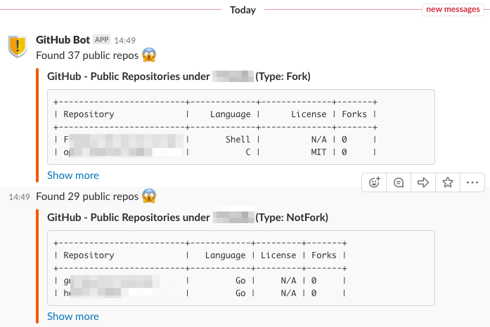

# GitHub Public Repositories Scanner

a simple helper tool for scanninag public repositories on GitHub

# Prerequisites

Slack Incoming Webhook - https://api.slack.com/incoming-webhooks

# Usage

    $ pip install -r requirements.txt
    $ ./github-scanner.py -o <org_name> -s <slack_incoming_webhook> [-v]

# Sample Output

### Slack Message Output

# Known Issue, Limitation

Currently, it will only return 100 public repositories

# License

[Apache-2.0](LICENSE)
